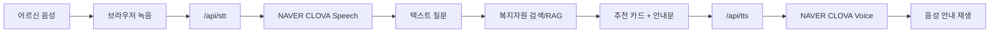

# 찾아봇 음성 대화 설계

## 목표

어르신이 타자 입력 없이도 현재 상황을 말로 표현하고, 찾아봇이 이를 복지자원 탐색으로 연결할 수 있게 한다. 결과 추천은 화면 카드와 음성 안내를 함께 제공한다.

## 현재 MVP

- STT: 브라우저 Web Speech API 기반 한국어 음성 인식
- TTS: 브라우저 `speechSynthesis` 기반 한국어 음성 안내
- 상황 질문 듣기: 홈 화면 `질문 듣기` 버튼으로 현재 랜덤 첫 질문을 음성 안내
- 음성 안내: `음성 안내 켜기`를 누르면 찾아봇 말풍선을 읽어줌
- 배포 조건: HTTPS 환경 또는 localhost에서 마이크 권한 필요

## 운영 버전 권장 구조

프론트엔드에 네이버 API 키를 직접 넣지 않는다. Vercel Serverless Function 또는 별도 백엔드에서 API 키를 보관하고, 프론트엔드는 `/api/stt`, `/api/tts`만 호출한다.



## 네이버 연동 후보

- NAVER Cloud CLOVA Speech: 음성을 텍스트로 바꾸는 STT 서비스. 챗봇, 자막, 음성 메모 등에 활용 가능.
- NAVER Cloud CLOVA Voice: 텍스트를 자연스러운 음성으로 합성하는 TTS 서비스. 속도, 감정, 음색 등 파라미터 기반 음성 합성 가능.
- 기존 CSR은 CLOVA Speech로 통합 안내가 있으므로 신규 개발은 CLOVA Speech 중심으로 검토한다.

## API 설계

### `/api/stt`

- 입력: `multipart/form-data` 또는 오디오 Blob
- 출력:

```json
{
  "text": "혼자 살다가 쓰러질까 봐 걱정돼요"
}
```

### `/api/tts`

- 입력:

```json
{
  "text": "위험하거나 긴급한 상황일 수 있어요. 지금 바로 위험하면 119에 연락해 주세요.",
  "voice": "friendly",
  "speed": -1
}
```

- 출력: `audio/mpeg` 또는 임시 오디오 URL

## 어르신 UX 원칙

- 첫 질문은 생활 도움과 활동·여가를 모두 열어두는 문장으로 랜덤 노출한다.
- 한 번에 하나만 묻는다.
- 음성 입력은 질문을 잘 모르는 사용자가 편하게 상황을 설명하기 위한 접근성 장치로 둔다.
- 답변은 화면 카드와 음성 안내를 함께 제공한다.
- 의료·응급·위기 질문은 일반 추천보다 공식 문의처와 긴급 안내를 먼저 말한다.
- 음성 안내는 사용자가 켰을 때만 자동 재생한다. 갑작스러운 자동 재생은 놀랄 수 있으므로 피한다.

## 결과보고서 표현

> 음성 기반 접근성을 강화하기 위해 MVP에는 브라우저 내장 STT/TTS를 적용하고, 운영 버전에서는 국내 결제가 가능한 NAVER Cloud CLOVA Speech 및 CLOVA Voice를 서버리스 API로 연동하는 구조를 설계하였다. 이를 통해 어르신이 직접 타자를 입력하지 않아도 현재 상황을 말로 설명하고, 찾아봇이 질문 의도를 생활 도움/활동·여가 축 및 세부 복지자원 카테고리로 연결하는 확장 가능성을 확보하였다.

## 참고 공식 문서

- NAVER Cloud CLOVA Speech: https://www.ncloud.com/product/aiService/clovaSpeech
- NAVER Cloud CLOVA Voice: https://www.ncloud.com/product/aiService/clovaVoice
- CLOVA Speech API Guide: https://api.ncloud-docs.com/docs/ai-application-service-clovaspeech
- CLOVA Voice API Guide: https://api.ncloud-docs.com/docs/ai-naver-clovavoice
